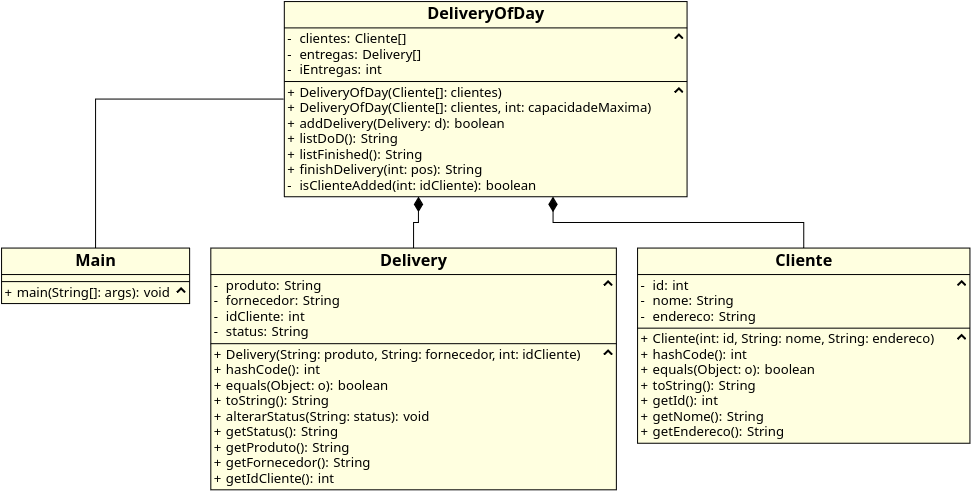

# Especificações - HugsAndSmiles

## Informações

Período: 2019.2

Estágio: 1º (No dia 16/04/2019)

Texto de especificação: [Texto](https://docs.google.com/document/d/e/2PACX-1vRWiM4knsnIoVIt6ZvjMFWndyi-hVvGze1rIy1UVT_fGqeMmVwvQx9ERiX0Mi-f2IBYlLQH4_3uueDX/pub)

## Diagrama UML



## Notação Modeligado

```
Main
association DeliveryOfDay
---
---
+ main(String[]: args): void
---


DeliveryOfDay
composes Delivery
composes Cliente
---
- clientes: Cliente[]
- entregas: Delivery[]
- iEntregas: int
---
+ DeliveryOfDay(Cliente[]: clientes)
+ DeliveryOfDay(Cliente[]: clientes, int: capacidadeMaxima)
+ addDelivery(Delivery: d): boolean
+ listDoD(): String
+ listFinished(): String
+ finishDelivery(int:pos): String
- isClienteAdded(int: idCliente): boolean
---


Delivery
---
- produto: String
- fornecedor: String
- idCliente: int
- status: String
---
+ Delivery(String: produto, String: fornecedor, int: idCliente)
+ hashCode(): int
+ equals(Object: o): boolean
+ toString(): String
+ alterarStatus(String: status): void
+ getStatus(): String
+ getProduto(): String
+ getFornecedor(): String
+ getIdCliente(): int
---


Cliente
---
- id: int
- nome: String
- endereco: String
---
+ Cliente(int: id, String: nome, String: endereco)
+ hashCode(): int
+ equals(Object: o): boolean
+ toString(): String
+ getId(): int
+ getNome(): String
+ getEndereco(): String
---
```
