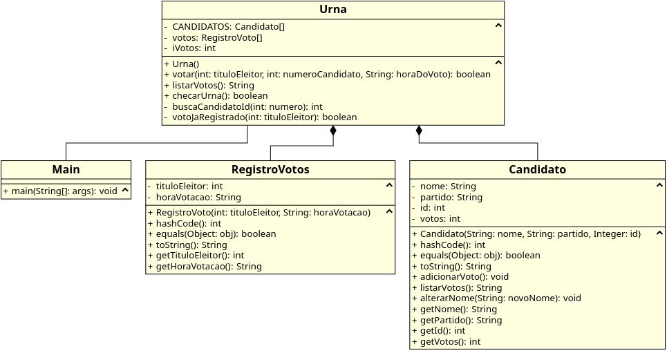

# Especificações - LigadoNasEleicoesPresidenciais

## Informações

Período: 2018.1

Estágio: 1º (No dia 17/05/2018)

Texto de especificação: [Texto](https://docs.google.com/document/d/e/2PACX-1vScJ0a_3f_-BE5nmGpVoHbGQ05esJfFn4Tzq--jOVJfs0g5auAnWQsitrgcrsOXfTVoaIHiGYGN8Lv7/pub)

## Diagrama UML



## Notação Modeligado

```
Main
association Urna
---
---
+ main(String[]: args): void
---


Urna
composes RegistroVotos
composes Candidato
---
- CANDIDATOS: Candidato[]
- votos: RegistroVoto[]
- iVotos: int
---
+ Urna()
+ votar(int: tituloEleitor, int: numeroCandidato, String: horaDoVoto): boolean
+ listarVotos(): String
+ checarUrna(): boolean
- buscaCandidatoId(int: numero): int
- votoJaRegistrado(int: tituloEleitor): boolean
---


RegistroVotos
---
- tituloEleitor: int
- horaVotacao: String
---
+ RegistroVoto(int: tituloEleitor, String: horaVotacao)
+ hashCode(): int
+ equals(Object: obj): boolean
+ toString(): String
+ getTituloEleitor(): int
+ getHoraVotacao(): String
---


Candidato
---
- nome: String
- partido: String
- id: int
- votos: int
---
+ Candidato(String: nome, String: partido, Integer: id)
+ hashCode(): int
+ equals(Object: obj): boolean
+ toString(): String
+ adicionarVoto(): void
+ listarVotos(): String
+ alterarNome(String: novoNome): void
+ getNome(): String
+ getPartido(): String
+ getId(): int
+ getVotos(): int
---
```
